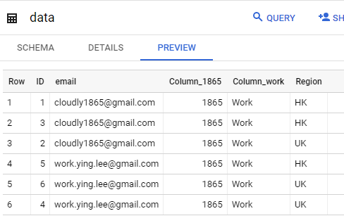
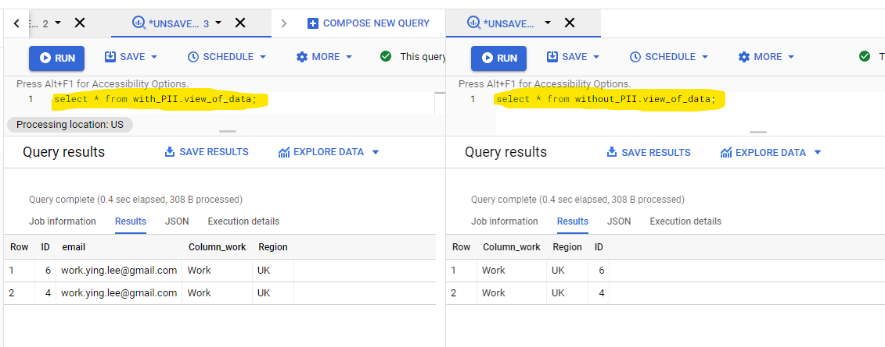

# Attributes-Based-Access-Control-on-BigQuery-Analytics


# BigQuery Built-in Access Control: Role-Based (https://cloud.google.com/bigquery/docs/access-control)

When an identity calls a Google Cloud API, BigQuery requires that the identity has the appropriate permissions to use the resource. You can grant permissions by granting roles to a user, a group, or a service account.

To grant access to a BigQuery resource, assign one or more roles to a user, group, or service account. You can grant access at the following BigQuery resource levels:

1.organization or Google Cloud project level

2.dataset level

3.table or view level

# Why Attribute-based access control (ABAC) (https://en.wikipedia.org/wiki/Attribute-based_access_control)? 
Historically, access control models have included mandatory access control (MAC), discretionary access control (DAC), and more recently role-based access control (RBAC). These access control models are user-centric and do not take into account additional parameters such as resource information, the relationship between the user (the requesting entity) and the resource, and dynamic information e.g. time of the day or user IP. ABAC tries to address this by defining access control based on attributes which describe the requesting entity (the user), the targeted object or resource, the desired action (view, edit, delete...), and environmental or contextual information. This is why access control is said to be attribute-based.

# Why Native Instead of Proxy Based SQL Rewriting?
BigQuery has many features to support ABAC, such as authorized view, policy tag (column-level access control), row access policy (row-level), table function, and procedure. And luckily these features can coexist.
For an editable table, policy tag and row access policy can still keep the result editable. Authorized view, table function, and procedure are flexible methods to build ABAC. But there is a born weakness, the result is read-only. For we only consider analytics situations, this weakness is acceptable. 

- Why not policy tag: No ABAC possible due to technology limits (only one policy tag is allowed for a column). It’s heavy too.
- Why not Row ACCESS POLICY? No ABAC is possible due to technology limits (no UDF and other data sources are allowed). It’s heavy too.
- Why not Session: Early-stage.
- Why not UDF? Limited to no table result.
- Why Authorized view? Regarding the same table, different views can be created for different context.

 A Procedure will be used to create corresponding authorized views at fly. 

Actually there is a SQL rewriting method to implement ABAC. This method is general to any SQL data sources, but has overhead on performance and has a potential security problem.

# Why not UI? Instead Script-based
This solution will focus on scripted ABAC. There is no UI for end user to define access policies. Basically this is a POC (proof of concept) solution.

# Where to Store Attributes?
For convenience, it is good to store the attributes into BigQuery tables.

# Why not Commercial Solution?
Why not vendors’ solutions? They are general to CRUD. They are general to all kinds of data sources. Instead, we focus on specific data sources, specific use situations (Analytics).

## Weakness: No UI.

## Advantages: 
- Native solution.
- Light-weight.
- Integration possible, but not required.
- Ready to deploy and customized immediately
- Free and Open source

# Progress
Some POC tests have been done. The code and the test data have been uploaded.

## The core code

```
CREATE OR REPLACE PROCEDURE `poised-renderer-284307.abac.CreateViewWithContext`(context_name STRING)
BEGIN

DECLARE pii BOOL;
DECLARE cols STRING;
DECLARE view_name STRING;

set pii=(select max(c.PII_Allowed) from `poised-renderer-284307.abac.Context_Attributes` as c where c.Context=context_name );

IF (pii is NULL) or (pii = FALSE) THEN
    set pii=FALSE;
    set view_name='poised-renderer-284307.without_PII.view_of_data';
    CREATE SCHEMA  IF NOT EXISTS `poised-renderer-284307.without_PII`;
ELSE 
    set pii=TRUE;
    set view_name='poised-renderer-284307.with_PII.view_of_data';
    CREATE SCHEMA  IF NOT EXISTS `poised-renderer-284307.with_PII`;
END IF;

IF pii THEN
    SET cols = (
    select String_Agg(d.col_name,",") from `poised-renderer-284307.abac.Data_Attributes` as d, `poised-renderer-284307.abac.User_Attributes` as u 
    where u.Session_User=Session_User() and u.Region in UNNEST(split(d.Regions,";")));
ELSE 
    SET cols = (
    select String_Agg(d.col_name,",") from `poised-renderer-284307.abac.Data_Attributes` as d, `poised-renderer-284307.abac.User_Attributes` as u 
    where u.Session_User=Session_User() and u.Region in UNNEST(split(d.Regions,";")) and d.PII=FALSE );
END IF;

EXECUTE IMMEDIATE format("""
  CREATE or REPLACE View %s as  
  SELECT 
    %s
  FROM `poised-renderer-284307.abac.data`
  where email=Session_User() and Region in 
  ( select Region from `poised-renderer-284307.abac.User_Attributes` 
    where Session_User=Session_User() 
  )
""",  view_name, cols);

END;
```

## The original data:


## The data with contexts, actually different authorized views with the same view name while different dataset name:

